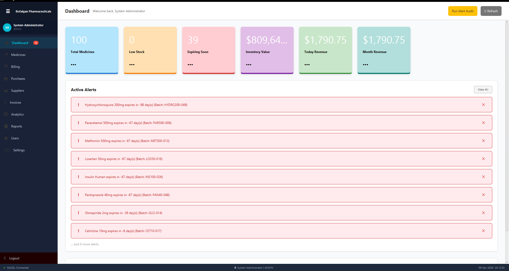
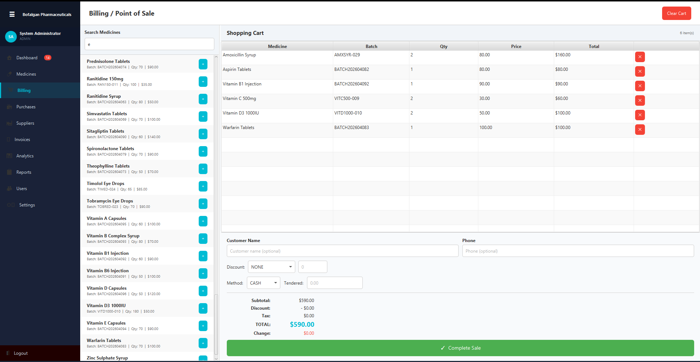
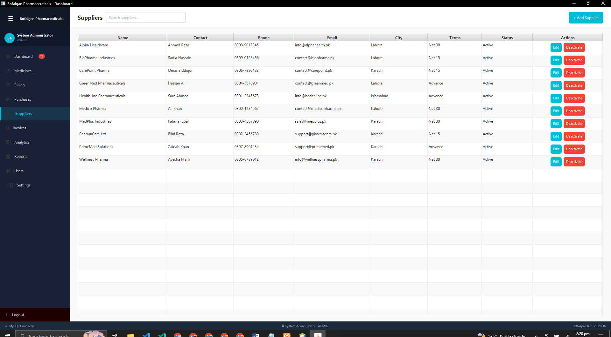
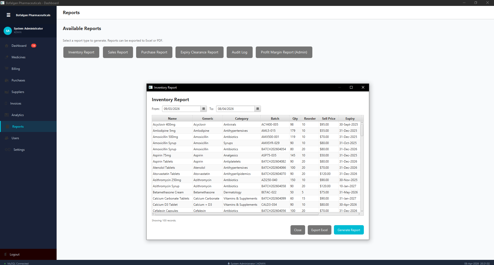
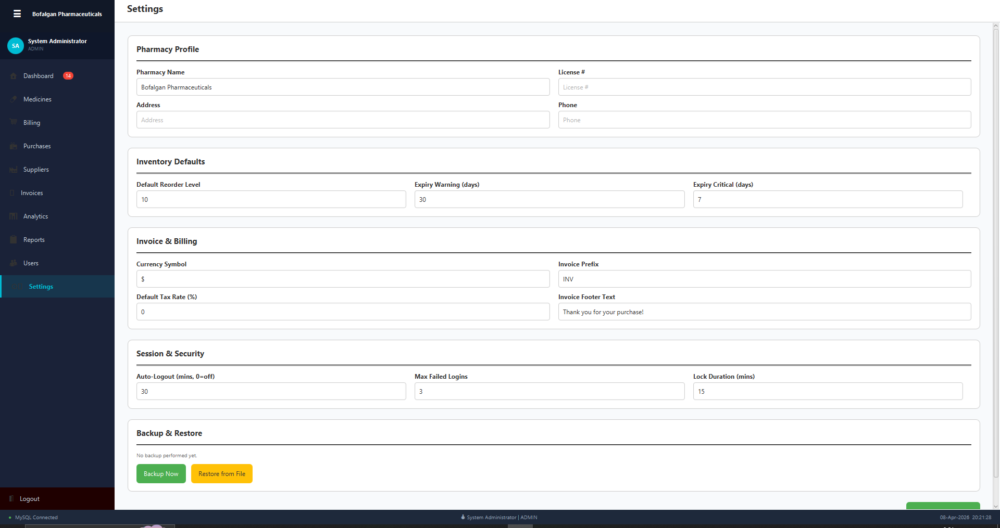

<div align="center">


<br/>

# ⚕️ Bofalgan Pharmaceuticals
### Desktop Pharmacy Management System

<br/>

[](https://www.oracle.com/java/)
[](https://openjfx.io/)
[](https://www.mysql.com/)
[](LICENSE)
[](https://ant.apache.org/)

<br/>

> A production-ready, offline-first desktop pharmacy management system built entirely in pure JavaFX - no frameworks, no shortcuts.

<br/>

Built by **Arsalan Khan** - BS Software Engineering

</div>

---

## 📋 Table of Contents

- [Overview](#-overview)
- [Screenshots](#-screenshots)
- [Features](#-features)
- [Architecture](#-architecture)
- [Tech Stack & Libraries](#-tech-stack--libraries)
- [Project Structure](#-project-structure)
- [Database Schema](#-database-schema)
- [Getting Started](#-getting-started)
- [Build & Run](#-build--run)
- [Default Login](#-default-login)
- [Workflow Guide](#-workflow-guide)
- [Dual Storage System](#-dual-storage-system)
- [Analytics Dashboard](#-analytics-dashboard)
- [UI Color Scheme](#-ui-color-scheme)
- [Author](#-author)

---

## 🧭 Overview

**Bofalgan Pharmaceuticals** is an offline-first desktop pharmacy management system built entirely in JavaFX. No internet required. No subscription fees. Just a full-featured, production-ready POS and inventory system that runs entirely on your local machine.

It handles everything a real pharmacy needs — medicine inventory, billing, purchase orders, supplier management, multi-user access with role-based permissions, analytics charts, Excel/PDF exports, and a complete audit trail.

The system uses **two storage layers simultaneously**: MySQL as the primary database and JSON files as a live secondary backup. Every write operation hits both. If MySQL goes down, the JSON files preserve your data.

---

## 📸 Screenshots

| Screen | Preview |
|--------|---------|
| Login Screen |  |
| Dashboard |  |
| Medicine Inventory |  |
| BillingPOS |  |
| Analytics Dashboard |  |
| Purchase Orders |  |
| Invoice History |  |
| Suppliers |  |
| Reports |  |
| Settings |  |
| User Management |  |

> 📁 All screenshots are located in the [`screenshots/`](BofalganPharmacy/screenshots/) directory.

---

## ✨ Features

### Phase 1 — Core Foundation

- Full medicine inventory CRUD with expiry color-coding (red / yellow / green rows)
- Real-time search with 300ms debounce across name, generic name, batch number, and barcode
- Dashboard with 6 live metric cards — total medicines, low stock, expiring soon, inventory value, today's revenue, and monthly revenue
- Smart alert engine — auto-generates `LOW_STOCK` and `EXPIRY` warnings in the background
- Excel export (Apache POI) for inventory, invoices, and reports
- Soft delete on all entities — data is never permanently lost

### Phase 2 — Advanced Capabilities

- Login system with BCrypt password hashing (12 salt rounds)
- Account lockout after 3 failed attempts — locked for 15 minutes
- Role-based access control: `ADMIN` vs `STAFF` with 20+ granular permission checks
- Session timeout with configurable idle detection
- Supplier management with full contact info and purchase history
- Purchase Order system — create POs, auto-update stock on confirmation
- Billing / Point-of-Sale screen with cart, barcode scanner support, discount (% or fixed), and change calculator
- Invoice generation with auto-numbered format `INV-2024-00001`
- PDF invoice export via Apache PDFBox
- Full activity audit log — every action logged with user, entity, and old/new values

### Phase 3 — Premium Features

- Analytics dashboard with 5 tabs: Sales, Top Medicines, Inventory, Expiry Analysis, Supplier Performance
- All charts use real data from MySQL — no mock or dummy data anywhere
- 7 report types: Inventory, Sales, Purchase, Expiry Clearance, Profit Margin, Supplier Payments, Audit Log
- Barcode lookup in billing screen — scan barcode → auto-add to cart
- Settings screen with pharmacy profile, invoice customization, and security config
- Manual + automated backup to local folder
- Admin password reset with temporary password generation

---

## 🏗️ Architecture

```
┌─────────────────────────────────────────────────────────┐
│                   JavaFX UI Layer                       │
│   LoginController → MainController → [Screen Ctrls]    │
│   Pure Java — NO FXML, NO XML, NO Scene Builder         │
└────────────────────────┬────────────────────────────────┘
                         │
┌────────────────────────▼────────────────────────────────┐
│                   Service Layer                         │
│   AuthService · MedicineService · InvoiceService        │
│   PurchaseService · UserService · SupplierService       │
│   Business logic, validation, permission checks here    │
└────────────────────────┬────────────────────────────────┘
                         │
          ┌──────────────▼──────────────┐
          │                             │
┌─────────▼─────────┐       ┌──────────▼──────────┐
│    MySQL via       │       │  JSON File Storage   │
│    HikariCP Pool   │       │  (Secondary Backup)  │
│                    │       │                      │
│  medicines         │       │  medicines.json       │
│  suppliers         │       │  suppliers.json       │
│  users             │       │  users.json           │
│  invoices          │       │  invoices.json        │
│  purchases         │       │  purchases.json       │
│  invoice_items     │       │  alerts.json          │
│  purchase_items    │       │  settings.json        │
│  alerts            │       │  sync_log.json        │
│  activity_log      │       │                      │
│  settings          │       │  Auto-sync every 5min│
└────────────────────┘       └──────────────────────┘
```

**Design rules enforced throughout:**

- Controllers never touch SQL directly
- Services hold all business logic and validation
- DAOs handle all database queries
- `SessionManager` singleton manages auth state
- Every write to MySQL mirrors to JSON files
- Transactions wrap all multi-table operations

---

## 🛠️ Tech Stack & Libraries

| Component | Library | Version | Purpose |
|-----------|---------|---------|---------|
| UI Framework | JavaFX | 17.x | All screens, charts, components — pure Java |
| Primary DB | MySQL | 8.x | Main data store |
| Connection Pool | HikariCP | 5.x | MySQL connection pooling |
| Password Security | jBCrypt | 0.4 | BCrypt password hashing (12 rounds) |
| Excel Export | Apache POI | 5.x | `.xlsx` generation for inventory and reports |
| PDF Generation | Apache PDFBox | 2.x | Invoice PDF creation |
| JSON Storage | Gson | 2.x | Secondary file-based storage serialization |
| Logging | SLF4J + Logback | 1.7.x | Application event logging |
| Barcode (Phase 3) | ZXing Core | 3.x | Barcode lookup support |

### Full JAR List

Place all JARs in the `/lib` folder. The ANT build script picks them up automatically.

```
javafx-controls-17.x.jar        javafx-graphics-17.x.jar
javafx-base-17.x.jar            mysql-connector-java-8.x.jar
HikariCP-5.x.jar                slf4j-api-1.7.x.jar
slf4j-simple-1.7.x.jar          jbcrypt-0.4.jar
poi-5.x.jar                     poi-ooxml-5.x.jar
poi-ooxml-lite-5.x.jar          commons-collections4-4.x.jar
commons-compress-1.x.jar        commons-io-2.x.jar
commons-math3-3.x.jar           xmlbeans-5.x.jar
log4j-api-2.x.jar               pdfbox-2.x.jar
fontbox-2.x.jar                 commons-logging-1.x.jar
gson-2.x.jar                    core-3.x.jar  (ZXing)
javase-3.x.jar  (ZXing)
```

> No Maven. No Gradle. All JARs go in `/lib` and the ANT build handles the rest.

---

## 📁 Project Structure

```
BofalganPharmacy/
│
├── src/
│   └── com/bofalgan/pharmacy/
│       │
│       ├── Main.java                          ← App entry point, loading screen
│       │
│       ├── config/
│       │   ├── AppConfig.java                 ← All constants (DB, colors, paths)
│       │   ├── AppContext.java                ← DI wiring — all DAOs + Services
│       │   └── UIConstants.java               ← Fonts, spacing, sizes
│       │
│       ├── model/
│       │   ├── User.java
│       │   ├── Medicine.java
│       │   ├── Supplier.java
│       │   ├── Invoice.java + InvoiceItem.java
│       │   ├── Purchase.java + PurchaseItem.java
│       │   ├── Alert.java
│       │   └── ActivityLog.java
│       │
│       ├── db/
│       │   ├── DatabaseManager.java           ← HikariCP pool, transaction helper
│       │   └── SchemaInitializer.java         ← Creates 13 tables + seeds default data
│       │
│       ├── dao/
│       │   ├── MedicineDAO.java
│       │   ├── UserDAO.java
│       │   ├── SupplierDAO.java
│       │   ├── InvoiceDAO.java
│       │   ├── PurchaseDAO.java
│       │   ├── AlertDAO.java
│       │   ├── ActivityLogDAO.java
│       │   └── AnalyticsDAO.java              ← All chart/analytics queries
│       │
│       ├── service/
│       │   ├── AuthService.java               ← Login, BCrypt, lockout, session
│       │   ├── MedicineService.java
│       │   ├── InvoiceService.java
│       │   ├── PurchaseService.java
│       │   ├── UserService.java
│       │   ├── SupplierService.java
│       │   └── SessionManager.java            ← Singleton auth state + permissions
│       │
│       ├── controller/
│       │   ├── LoginController.java
│       │   ├── MainController.java            ← Sidebar nav + screen switching
│       │   ├── DashboardController.java
│       │   ├── MedicineController.java
│       │   ├── BillingController.java         ← POS / cart logic
│       │   ├── SupplierController.java
│       │   ├── PurchaseController.java
│       │   ├── InvoiceController.java
│       │   ├── AnalyticsController.java       ← 5-tab chart dashboard
│       │   ├── ReportsController.java
│       │   ├── SettingsController.java
│       │   └── UserManagementController.java
│       │
│       ├── ui/
│       │   └── UIFactory.java                 ← All reusable components (pure Java)
│       │
│       ├── storage/
│       │   └── FileStorageManager.java        ← JSON dual-storage + sync
│       │
│       └── util/
│           ├── DateUtils.java
│           ├── CurrencyFormatter.java
│           ├── ExcelExporter.java
│           ├── PDFExporter.java
│           ├── PharmacyException.java
│           ├── DatabaseException.java
│           └── ValidationException.java
│
├── lib/                   ← Place all dependency JARs here
├── data/                  ← JSON files auto-created at runtime
├── backups/               ← Backup archives stored here
├── screenshots/           ← All screenshots live here
├── resources/             ← Fonts, images (optional)
├── scripts/
│   ├── setup_mysql.sql    ← Run this first to create DB + user
│   ├── run.sh             ← Linux/macOS launch script
│   ├── run.bat            ← Windows launch script
│   └── build_and_run.sh   ← Combined ANT build + run
├── build.xml              ← ANT build configuration
└── README.md
```

---

## 🗄️ Database Schema

All 13 MySQL tables are created automatically on first launch via `SchemaInitializer.java`.

| Table | Description |
|-------|-------------|
| `medicines` | Core inventory with expiry, pricing, supplier link |
| `medicine_categories` | 18 pre-seeded categories (Antibiotics, Vitamins, etc.) |
| `suppliers` | Supplier contact info and payment terms |
| `users` | Auth with BCrypt hash, lockout tracking, roles |
| `purchases` | Purchase order headers |
| `purchase_items` | Line items per purchase |
| `invoices` | Sale invoice headers with payment info |
| `invoice_items` | Line items per invoice |
| `activity_log` | Full audit trail: who did what, when, old/new values |
| `alerts` | System alerts (`LOW_STOCK`, `EXPIRY_WARNING`, `EXPIRY_CRITICAL`) |
| `settings` | Key-value store for all app configuration |
| `customers` | Optional customer registry |

**Default seed data inserted on first run:**

- Admin user: `admin` / `Admin@123`
- 18 medicine categories
- 17 configurable system settings

---

## 🚀 Getting Started

### Prerequisites

- **Java 11 or higher** (Java 17 or 21 LTS recommended)
- **Apache ANT** installed — verify with `ant -version`
- **MySQL Server 8.x** running on `localhost:3306`

### Step 1 — Database Setup

Run the included SQL script:

```bash
mysql -u root -p < scripts/setup_mysql.sql
```

This creates the `bofalgan_pharmacy` database and the `bofalgan` user with full access. All 13 tables are then created automatically on the first application launch.

**Manual setup (optional):**

```sql
CREATE DATABASE bofalgan_pharmacy CHARACTER SET utf8mb4 COLLATE utf8mb4_unicode_ci;
CREATE USER 'bofalgan'@'localhost' IDENTIFIED BY 'BofalganDB@2024';
GRANT ALL PRIVILEGES ON bofalgan_pharmacy.* TO 'bofalgan'@'localhost';
FLUSH PRIVILEGES;
```

### Step 2 — Add Dependencies

Download all JAR files listed in the [Full JAR List](#full-jar-list) section and place them inside the `/lib` directory:

```
BofalganPharmacy/
└── lib/
    ├── javafx-controls-17.x.jar
    ├── mysql-connector-java-8.x.jar
    ├── HikariCP-5.x.jar
    └── ... (all other JARs)
```

### Step 3 — Clone the Repository

```bash
git clone https://github.com/arsalan-khan-dev/bofalgan-pharmaceuticals.git
cd bofalgan-pharmaceuticals
```

---

## 🔨 Build & Run

### Using ANT (Recommended)

```bash
# Compile all source files
ant compile

# Run the application
ant run

# Compile + run in one command
ant compile run

# Create a distributable JAR
ant jar
```

### Using Launch Scripts

```bash
# Linux / macOS
chmod +x scripts/run.sh
./scripts/run.sh

# Windows (double-click or run in CMD)
scripts\run.bat

# Combined build + run
./scripts/build_and_run.sh
```

---

## 🔑 Default Login

```
Username:  admin
Password:  Admin@123
```

> After logging in, go to **Settings → User Management** to add new users and update the admin password.

---

## 📖 Workflow Guide

### How to Add a Medicine

1. Navigate to **Medicines** from the sidebar
2. Click **+ Add Medicine**
3. Fill in: Name, Generic Name, Category, Unit, Batch Number, Quantity, Purchase Price, Selling Price, Expiry Date
4. Select a **Supplier** from the dropdown (add suppliers first if none exist)
5. Click **Save** — the medicine appears in the table immediately
6. The system auto-checks for low stock and expiry alerts

### How to Make a Sale (BillingPOS)

1. Navigate to **BillingPOS**
2. Search for a medicine by name or scan a barcode into the search field
3. Click **+** or double-click to add it to the cart
4. Enter the quantity when prompted
5. Apply a discount if needed — percentage or fixed amount
6. Enter the amount tendered — change calculates automatically
7. Click **Complete Sale**
8. Invoice is created, stock is deducted, and an invoice number is generated
9. Click **Print Invoice** to export as PDF

### How to Create a Purchase Order

1. Navigate to **Purchases**
2. Click **+ New Purchase**
3. Select a supplier
4. Add medicines: choose medicine → enter batch, quantity, unit price, expiry date → click **Add Item**
5. Set payment status (Paid / Partial / Pending)
6. Click **Create Purchase Order**
7. Stock quantities update automatically

### How to View Analytics

1. Navigate to **Analytics**
2. Click through the 5 tabs: Sales, Top Medicines, Inventory, Expiry Analysis, Supplier Performance
3. All charts load real data from the database
4. Click **Refresh Data** to reload all charts

### How to Generate Reports

1. Navigate to **Reports**
2. Click the report type (Inventory, Sales, Purchase, Expiry Clearance, Profit Margin, Audit Log)
3. Set the date range filter
4. Click **Generate Report**
5. Click **Export Excel** to save as `.xlsx`

### How to Manage Users *(Admin only)*

1. Navigate to **Users**
2. Click **+ Add User** — fill in username, full name, email, role, and password
3. Password must be 8+ characters with at least one uppercase letter, digit, and special character
4. To reset a password: click **Reset Pwd** → a temporary password is generated and displayed
5. To deactivate a user: click **Deactivate** — they can no longer log in but their data is preserved

---

## 💾 Dual Storage System

Every important operation writes to both storage layers simultaneously.

```
User Action (e.g. Add Medicine)
        │
        ▼
  MedicineService.addMedicine()
        │
        ├──► MedicineDAO.insert()  ──────────► MySQL  (primary)
        │
        └──► FileStorageManager.upsertRecord() ──► medicines.json  (secondary)
```

**JSON files stored in `/data/`:**

| File | Contents |
|------|----------|
| `medicines.json` | Full medicine records |
| `suppliers.json` | Supplier details |
| `users.json` | User accounts (password hashes included) |
| `invoices.json` | Invoice headers |
| `purchases.json` | Purchase order records |
| `alerts.json` | Active system alerts |
| `settings.json` | App configuration |
| `sync_log.json` | Last 500 sync operations with timestamps |

Auto-sync runs every 5 minutes in a background daemon thread. On startup, if MySQL is unreachable, an error screen shows a **Retry** button. If data recovery is needed, the JSON files in `/data/` contain a complete copy of all records.

---

## 📊 Analytics Dashboard

All 5 chart tabs pull live data from `AnalyticsDAO.java`. Nothing is hardcoded.

| Tab | Charts |
|-----|--------|
| **Sales** | Daily revenue line chart (30 days), Monthly revenue bar chart (12 months), Revenue by payment method pie chart |
| **Top Medicines** | Horizontal bar chart — top 10 medicines by units sold in last 30 days |
| **Inventory** | Stock quantity by category bar chart |
| **Expiry Analysis** | Expiry status pie chart (Expired / Critical / Warning / Safe), Expiry by month bar chart (next 6 months) |
| **Supplier Performance** | Total purchases per supplier bar chart |

---

## 🎨 UI Color Scheme

| Role | Hex | Usage |
|------|-----|-------|
| Primary | `#00BCD4` | Buttons, active states, metric card accents |
| Sidebar | `#1A2238` | Navigation background |
| Warning | `#FFC107` | Low stock alerts, warning badges |
| Error | `#F44336` | Critical expiry, delete buttons, error messages |
| Success | `#4CAF50` | Completed sales, confirmation messages |
| Text | `#333333` | Body text |
| Muted | `#666666` | Secondary labels |
| Border | `#CCCCCC` | Table borders, input borders |
| Alt Row | `#F5F5F5` | Table row alternation |

---

## 👤 Author

<div align="center">


### Arsalan Khan (KTK)

BS Software Engineering · Full Stack · AI & ML · Cybersecurity

📍 Islamabad, Pakistan

[](https://github.com/arsalan-khan-dev)

</div>

---

<div align="center">

⭐ **If this project helped you, consider leaving a star.**

<br/>

Built with ❤️ using **Java · MySQL · Pure JavaFX**

*No frameworks. No shortcuts. Just clean, production-grade code.*

</div>
